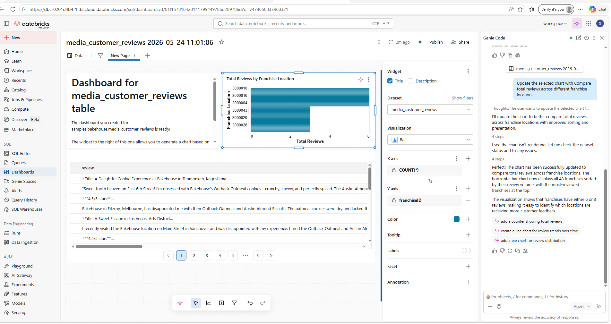

# Senait Amare Gebriye

## Environmental Data Analyst | Database Administrator | Data Analytics & AI Graduate Student

Welcome to my professional portfolio.

I am an Environmental Data Analyst and Database Administrator with over 10 years of experience managing, validating, analyzing, and optimizing environmental, hydrological, meteorological, and water quality datasets.

## Education

- Master of Science in Data Analytics and Artificial Intelligence (Expected 2026)
- Bachelor of Applied Science in Information Management – Database Administration and Data Analytics
- Associate Degree in Marketing Management and Entrepreneurship

## Technical Skills

### Databases
- Oracle Database
- Microsoft SQL Server
- MySQL
- Microsoft Access

### Analytics & Programming
- SQL
- Python
- Databricks
- SAS Viya
- C#

### Data Visualization
- Power BI
- Tableau
- Microsoft Excel

### Environmental Systems
- DBHYDRO
- GVA
- SWAT
- Data Depot

## Featured Projects
Portfolio Presentation
📄 [View Portfolio Presentation (PDF)](Presentations/portfoliopower.pdf)

📊 [Download PowerPoint Version](Presentations/portfoliopower.pptx)
### Environmental Data Validation and Quality Assurance
Performed quality assurance and validation of hydrologic and meteorological datasets from over 190 monitoring stations. Investigated anomalies, ensured data integrity, and maintained compliance with environmental standards.

Tools: GVA, DBHYDRO, SQL

### Power BI Environmental Dashboard
#### Dashboard Examples

Developed interactive dashboards to support environmental monitoring and decision-making. Created visual reports that improved access to operational and scientific data.

Tools: Power BI, SQL, Excel

### Machine Learning for Hydrologic Time-Series Analysis
Applied Linear Regression, KNN, and Random Forest algorithms to analyze hydrologic time-series data and improve environmental forecasting.

Tools: Python, Pandas, Scikit-Learn

### Databricks Metadata Management

Implemented metadata management, data governance, and medallion architecture concepts using Databricks and Unity Catalog.

Tools: Databricks, Spark, Unity Catalog

### SQL Database Analytics
Designed and optimized relational databases while developing SQL queries and reports to support environmental and business analytics.

Tools: Oracle, SQL Server, MySQL

## Resume
## Research & Presentations

### Integrated Data Analytics and Machine Learning for Environmental Time-Series Analysis

Poster Presentation

University of Minnesota
CSDMS Annual Meeting
May 2026

Developed a framework for environmental time-series analysis using statistical and machine learning techniques, including Linear Regression, KNN, and Random Forest models for hydrologic applications.

[Download Resume](Resume_Senait_Gebriye_05282026.pdf)

## Contact

📧 senaitgebriye@gmail.com

📍 Boynton Beach, Florida

GitHub: [shisenai](https://github.com/shisenai)

LinkedIn: [Senait Gebriye](https://www.linkedin.com/in/senait-gebriye/)

